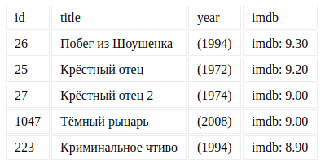

[](https://ci.appveyor.com/project/Sergius92739/ahj-2-3-dom/branch/master);

---

### In-Memory Sorting

#### Легенда

Вам с сервера приходят данные с фиксированным набором полей (см. описание ниже). Вам необходимо сгенерировать по этим данным html-таблицу и вставить её в DOM Tree. Поскольку мы ещё не проходили события, воспользуйтесь функцией `setInterval` для того, чтобы каждые 2 секунды менять порядок сортировки:
* по возрастанию - по первому полю (остальные поля не учитываются)
* по убыванию - по первому полю (остальные поля не учитываются)
* по возрастанию - по второму полю (остальные поля не учитываются)
* по убыванию - по второму полю (остальные поля не учитываются)
* по возрастанию - по третьему полю (остальные поля не учитываются)
* по убыванию - по третьему полю (остальные поля не учитываются)
* то же самое по четвёртому полю
* всё повторяется с первого пункта
Достаточно намучившись с `data-*` вы поняли, что хранить всю информацию в DOM и в атрибутах в частности, не всегда самая лучшая идея и решили реализовать хранение в памяти.

#### Описание

Формат приходящих данных (JSON):
```json
[
  {
    "id": 26,
    "title": "Побег из Шоушенка",
    "imdb": 9.30,
    "year": 1994
  },
  {
    "id": 25,
    "title": "Крёстный отец",
    "imdb": 9.20,
    "year": 1972
  },
  {
    "id": 27,
    "title": "Крёстный отец 2",
    "imdb": 9.00,
    "year": 1974
  },
  {
    "id": 1047,
    "title": "Тёмный рыцарь",
    "imdb": 9.00,
    "year": 2008
  },
  {
    "id": 223,
    "title": "Криминальное чтиво",
    "imdb": 8.90,
    "year": 1994
  }
]
```
Храните все полученные объекты в памяти в виде массива и сортировку осуществляйте на базе этого массива (мутировать массив или нет - решать вам). После каждой сортировки пересобирайте заново дерево DOM.

Формат генерируемого DOM должен быть такой же, как в задаче [ahj-2.2-dom](https://github.com/Sergius92739/ahj-2.2-dom).

Внешний вид без сортировки (вы можете визуально улучшить отображение):



Обратите внимание, в каком виде выводятся оценки (после точки всегда два символа).

При сортировке по id (по возрастанию):


Обратите внимание на стрелку возле id.


Всё должно собираться через Webpack (включая картинки и стили) и выкладываться на Github Pages через CI.
